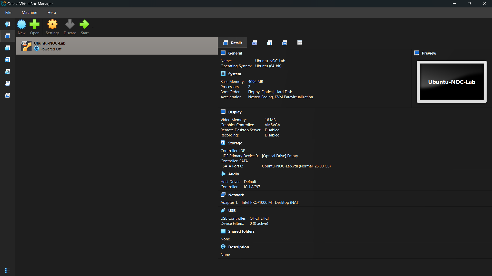
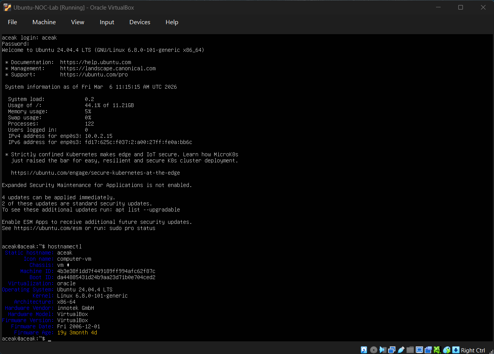

# VM Installation & Initial Setup

## Objective
To build a controlled lab environment for practicing infrastructure monitoring and troubleshooting scenarios aligned with NOC operations.

---

## Virtualization Platform
VirtualBox

---

## Ubuntu Server Configuration

- Version: Ubuntu Server LTS
- RAM Allocated: 2GB
- CPU: 2 Cores
- Disk: 25GB (Dynamically Allocated)
- Network Mode: NAT

### Installation Notes
- Installed via ISO image.
- Configured basic user credentials.
- Enabled SSH for remote access testing.

### Initial Validation Steps
- Verified IP configuration.
- Tested internet connectivity using ping.
- Confirmed SSH service status.

---

## Windows Server Configuration

- Version: Windows Server (Evaluation)
- RAM Allocated: 4GB
- CPU: 2 Cores
- Disk: 40GB
- Network Mode: NAT

### Installation Notes
- Installed using evaluation ISO.
- Completed basic system configuration.
- Enabled firewall rules for testing.

---

## Observations
- Initial network setup required NAT configuration adjustment.
- Verified connectivity between host and VM environment.

---

## Environment Proof

### Virtual Machine Overview

### Ubuntu Server Information

---

## Next Steps
- Implement system monitoring validation.
- Begin service failure simulation.
