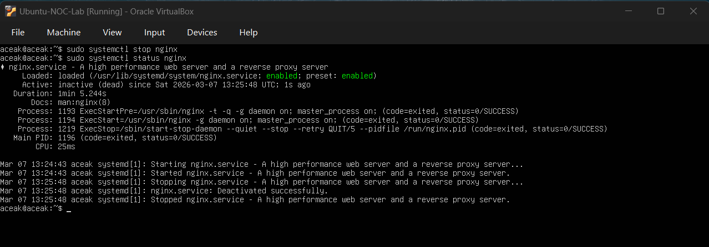
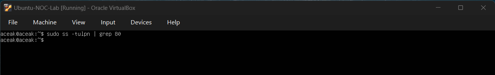
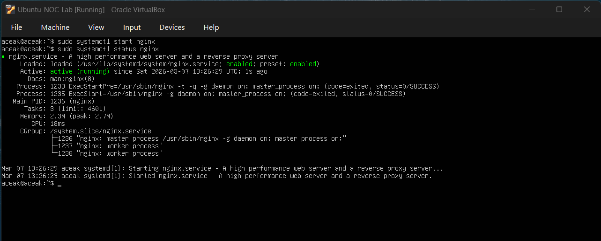

# Incident Simulation – Nginx Service Outage

## Incident Summary
The Nginx web service was intentionally stopped to simulate a service outage scenario.

---

## Detection

- `systemctl status nginx` showed: **inactive (dead)**

The output below confirms that the nginx service was inactive during the simulated outage.

### Service Status – Inactive

- Port 80 was not listening.

---

## Impact

Web service unavailable locally.  
HTTP service on port 80 was inaccessible.

---

## Investigation

Verified service status using:

sudo systemctl status nginx

Checked listening ports using:

sudo ss -tulpn | grep 80

The output below confirms that Port 80 was not listening during the simulated outage.

### Port 80 Not Listening

No configuration errors were identified.

---

## Root Cause

The nginx service was stopped manually to simulate a service failure scenario.

---

## Resolution

Executed:

sudo systemctl start nginx

Verified service restoration:

- `systemctl status nginx` → **active (running)**

The output below confirms that nginx returned to an active (running) state after the restart.

### Service Restored

---

## Preventive Consideration

In production environments, monitoring tools should:

- Trigger alerts if the service becomes inactive  
- Monitor port 80 health  
- Perform automated restarts if configured  
- Log service state transitions for auditing
