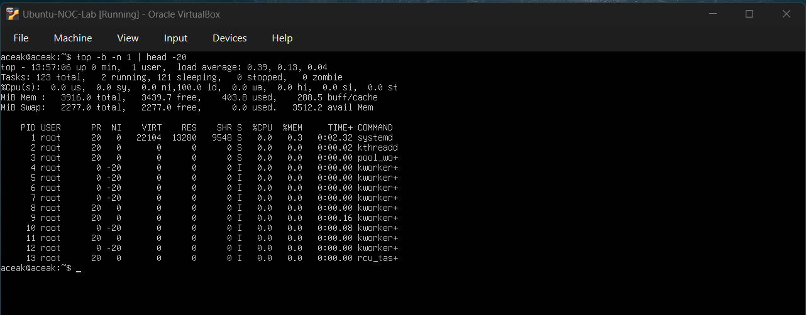
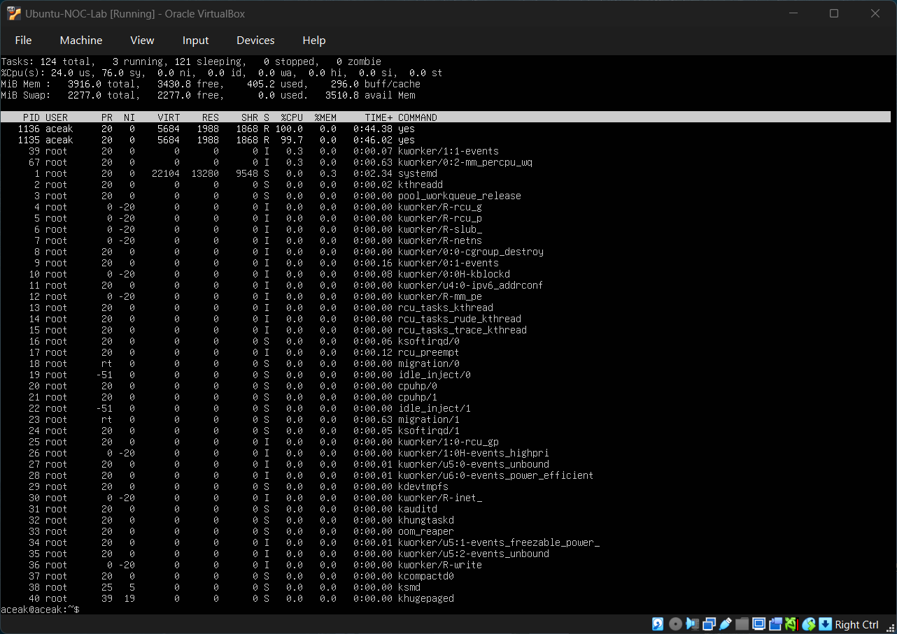
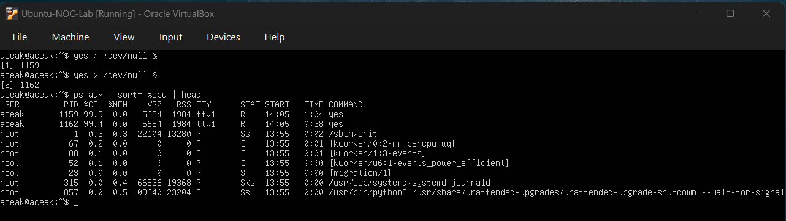
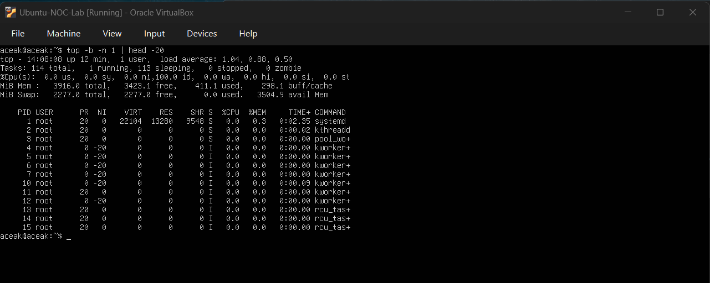

# CPU Spike Simulation

## Objective
To simulate a high CPU usage incident, investigate the root cause, and restore system performance using Linux monitoring and process management commands.

---

## Baseline System Check

### Command Executed
top

### Output Observed
- CPU idle at **100.0%**
- Memory used: **~408 MiB**
- No abnormal processes
- System operating normally

### Baseline Snapshot

### Interpretation
The system was in a healthy state with no performance issues. This baseline confirms normal server behavior before simulating the CPU incident.

---

## CPU Spike Simulation

### Command Executed
yes > /dev/null (executed three times)

### Output Observed (using top)
- Tasks: **115 total**, **3 running**
- CPU usage:
  - **22.5% user (us)**
  - **77.1% system (sy)**
  - **~2.7% software interrupt (si)** (intermittent)
- Multiple "yes" processes detected

### CPU Spike Detected

### Interpretation
The system experienced high CPU utilization caused by multiple user-space processes continuously generating output. The elevated system CPU percentage indicated heavy kernel activity handling process operations.

---

## Root Cause Investigation

### Command Executed
ps aux --sort=-%cpu | head

### Output Observed
- Identified "yes" processes under the current user account
- Process IDs observed: **PID 998 and PID 997**
- Each consuming approximately **99% CPU**

### High CPU Processes Identified

### Interpretation
The CPU spike was confirmed to be caused by runaway user processes. This type of issue is classified as a **process-level CPU saturation incident**.

---

## Incident Resolution

### Command Executed
pkill yes

### Output Observed
- Terminal displayed:
  - "Terminated" messages for background yes processes
- Processes successfully stopped

### Interpretation
The runaway processes were safely terminated, removing the source of excessive CPU utilization.

---

## Post-Incident Validation

### Command Executed
top

### Output Observed
- CPU returned to **100.0% idle**
- Only **1 running task**
- No high-usage processes present
- System performance normalized

### CPU Restored to Normal

### Interpretation
System resources returned to normal levels, confirming successful incident resolution and restoration of system stability.

---

## Skills Practiced

- CPU performance monitoring using `top`
- Identifying resource-intensive processes
- Investigating root cause using `ps`
- Managing runaway processes
- Validating system recovery
- NOC-style incident documentation

---

## Conclusion

This exercise simulated a real-world NOC scenario involving CPU saturation caused by runaway processes. The incident lifecycle included detection, investigation, root cause identification, resolution, and validation of system recovery.
