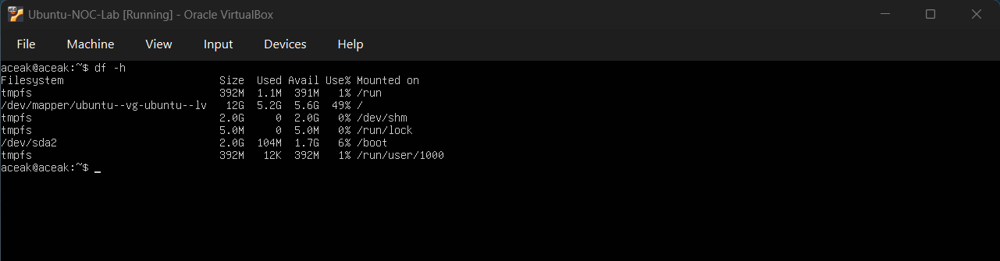
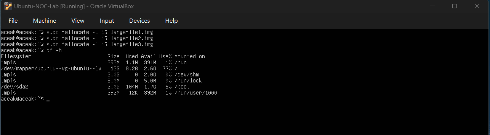
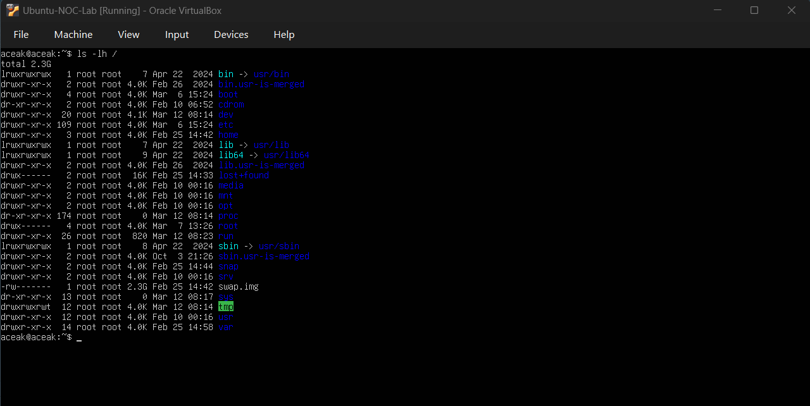
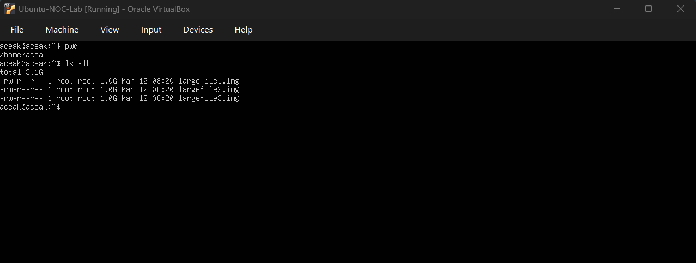
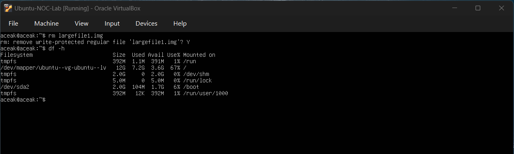
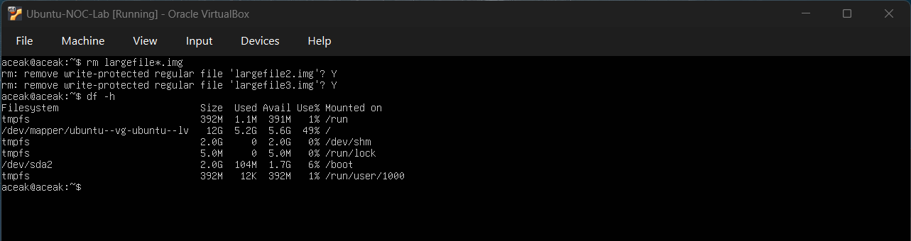

# Disk Space Exhaustion Simulation

## Objective
To simulate a disk space exhaustion incident, investigate potential causes, identify the root cause, and restore system storage using Linux monitoring and troubleshooting commands.

---

## Baseline Disk Check

### Command Executed
df -h

### Output Observed
- Filesystem: /dev/mapper/ubuntu--vg-ubuntu--lv mounted on `/`
- Total Size: 12G
- Used: 5.2G
- Available: 5.6G
- Usage: 49%

### Baseline Snapshot

### Interpretation
Disk usage was within normal operating limits and no immediate storage risk was observed.

---

## Disk Consumption Simulation

### Command Executed
sudo fallocate -l 1G largefile1.img  
sudo fallocate -l 1G largefile2.img  
sudo fallocate -l 1G largefile3.img  
df -h

### Output Observed
- Disk usage increased to approximately 77%

### Disk Exhaustion Detected

### Interpretation
Rapid storage allocation simulated a high disk utilization alert condition.

---

## Root Directory Investigation

### Command Executed
ls -lh /

### Output Observed
- Observed `swap.img` consuming approximately 2.3G

### Root Directory Snapshot

### Interpretation
Although large in size, `swap.img` is a system-managed file and not responsible for sudden disk growth.

---

## Directory Verification

### Command Executed
pwd  
ls -lh

### Output Observed
- Current directory: `/home/aceak`
- Identified multiple `largefile*.img` files
- Each file approximately 1.0G

### Large Files Identified

### Interpretation
The disk usage spike was caused by user-generated files within the home directory.

---

## Controlled Incident Resolution

### Command Executed
rm largefile1.img  
df -h

### Output Observed
- Disk usage reduced from 77% to 67%

### Partial Cleanup Snapshot

### Interpretation
Removal of one large file confirmed the identified root cause.

---

## Complete Cleanup and Validation

### Command Executed
rm largefile*.img  
df -h

### Output Observed
- Used: 5.2G
- Available: 5.6G
- Usage: 49%

### Final Validation Snapshot

### Interpretation
System storage returned to baseline levels, confirming successful incident resolution.

---

## Skills Practiced

- Disk monitoring using `df`
- File inspection using `ls`
- Directory verification using `pwd`
- Identifying root cause of storage growth
- Controlled remediation procedures
- Post-incident validation workflow

---

## Conclusion

This exercise simulated a real-world disk exhaustion incident. The investigation required distinguishing system-managed files from abnormal user-generated storage growth, followed by structured cleanup and validation of system recovery.
