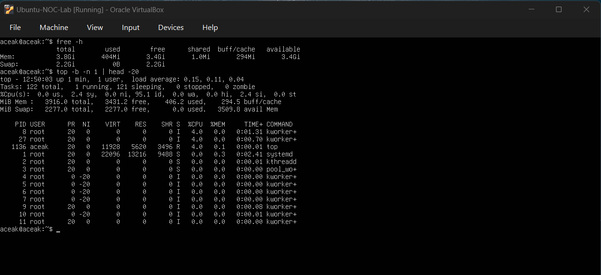
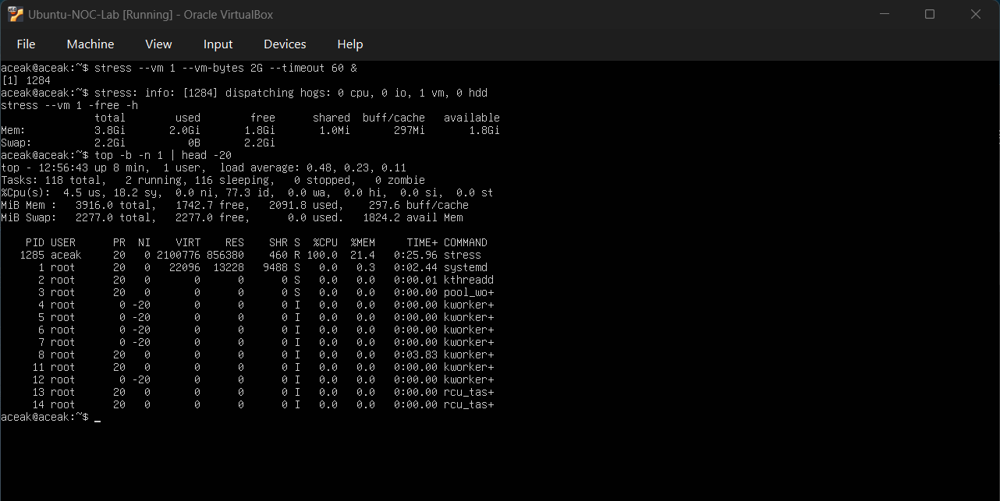
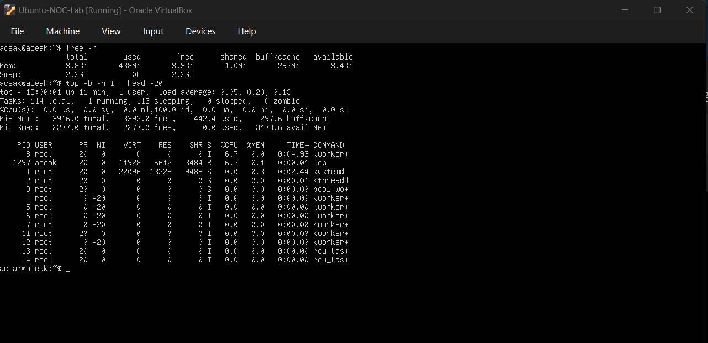

# Memory Pressure Simulation

## Objective
To simulate high memory usage, observe system behavior under memory pressure, identify the memory-consuming process, and validate system recovery after the stress condition ends.

---

## Baseline Memory Check

### Command Executed
free -h  
top -b -n 1 | head -20

### Output Observed
- Total Memory: **3.8 GiB**
- Used: **404 MiB**
- Free: **3.4 GiB**
- Available: **3.4 GiB**
- Buff/cache: **294 MiB**
- Swap: **2.2 GiB total, 0B used**
- CPU idle: ~95%

### Baseline Snapshot

### Interpretation
The system memory was in a healthy state with minimal utilization and no swap activity. CPU usage was low and no memory-intensive processes were running.

---

## Memory Stress Simulation

### Command Executed
stress --vm 1 --vm-bytes 2G --timeout 60 &

### Output Observed (During Stress)
- Total Memory: **3.8 GiB**
- Used: **2.0 GiB**
- Free: **1.8 GiB**
- Available: **1.8 GiB**
- Buff/cache: **297 MiB**
- Swap: **0B used**
- Stress process PID: **1285**
- VIRT: **~2100776 KiB**
- RES: **~856380 KiB**
- CPU usage: **100%**
- %MEM: **21.4%**

### Under Stress Snapshot

### Interpretation
The stress process allocated approximately 2 GiB of memory, significantly increasing memory utilization. The process consumed 100% CPU while allocating memory, confirming controlled memory pressure simulation.

---

## Post-Stress Validation

### Command Executed
free -h  
top -b -n 1 | head -20

### Output Observed
- Total Memory: **3.8 GiB**
- Used: **438 MiB**
- Free: **3.3 GiB**
- Available: **3.4 GiB**
- Buff/cache: **297 MiB**
- Swap: **0B used**
- CPU idle: **100%**
- No stress process present

### Post-Stress Snapshot

### Interpretation
Memory usage returned close to baseline levels after the stress process completed. No swap usage occurred and system stability was fully restored. This confirms successful memory pressure handling without triggering out-of-memory (OOM) events.

---

## Skills Practiced

- Monitoring memory usage using `free` and `top`
- Simulating memory pressure using `stress`
- Identifying memory-intensive processes
- Interpreting VIRT vs RES metrics
- Observing system responsiveness under load
- Validating system recovery post-incident

---

## Conclusion

This exercise simulated a real-world memory pressure incident in a Linux environment. The stress process was identified as the root cause of increased memory usage, and the system automatically recovered after the process completed. The simulation demonstrated controlled incident handling, root cause verification, and structured post-incident validation.
