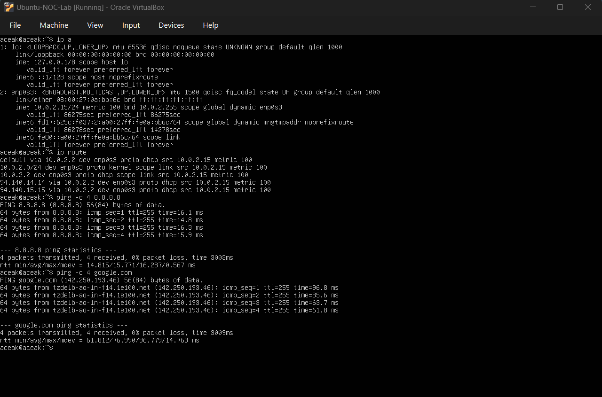
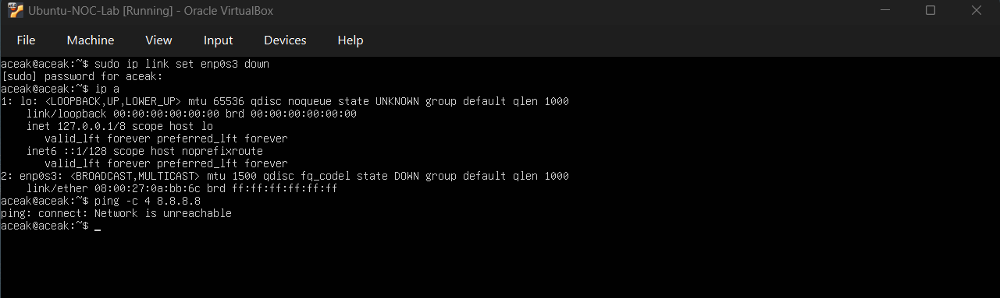
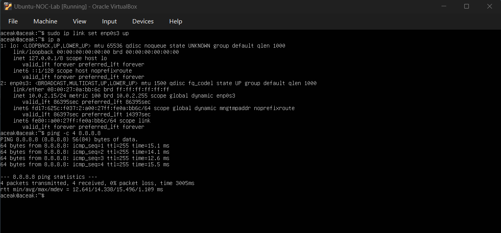
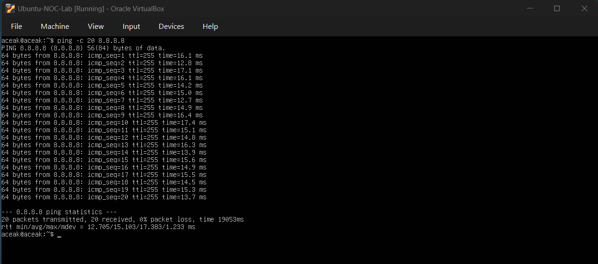
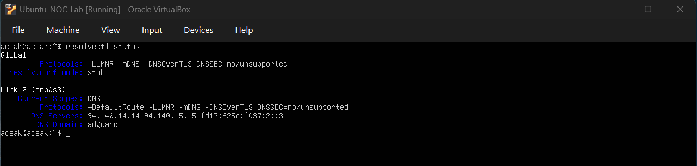
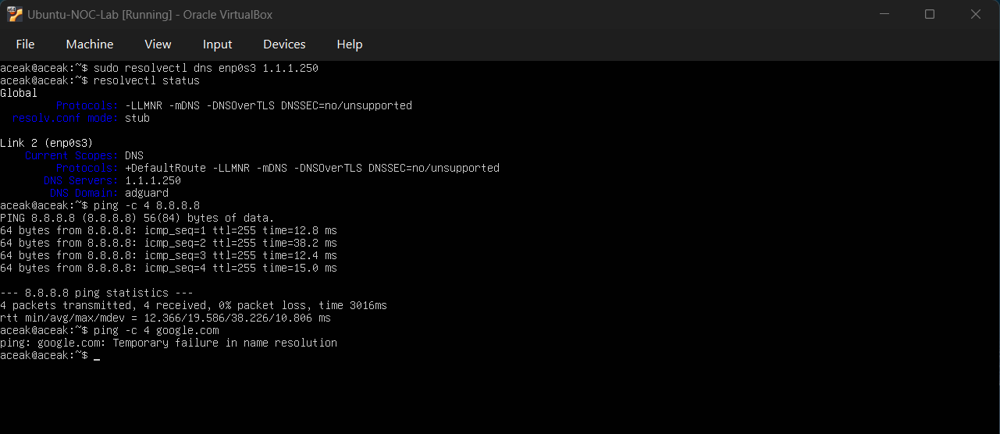
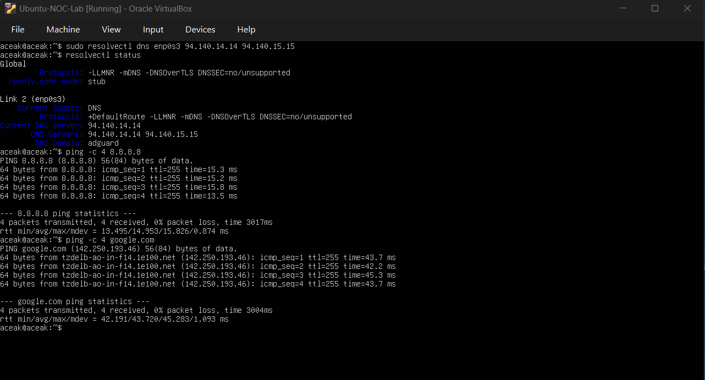

# Network Troubleshooting & DNS Failure Simulation

## Objective
To simulate network-level failures, isolate the root cause using structured troubleshooting steps, and restore full system connectivity. This exercise covers both interface-level failure and DNS resolution failure scenarios.

---

## Baseline Network Validation

### Commands Executed
ip a  
ip route  
ping -c 4 8.8.8.8  
ping -c 4 google.com  

### Output Observed
- Interface `enp0s3` assigned IP: **10.0.2.15/24**
- Default gateway: **10.0.2.2 via enp0s3**
- Ping to **8.8.8.8** successful (0% packet loss)
- Ping to **google.com** successful (0% packet loss)

### Baseline Snapshot

### Interpretation
The network stack was fully operational with working routing and DNS resolution.

---

## Simulated Interface-Level Network Failure

### Command Executed
sudo ip link set enp0s3 down  

### Verification Command
ip a  

### Connectivity Test
ping -c 4 8.8.8.8  

### Output Observed
- Interface `enp0s3` state changed to **DOWN**
- Ping failed with:  
  **"connect: Network is unreachable"**

### Interface Down Evidence

### Interpretation
The system was unable to route traffic because the primary network interface was administratively disabled. This represents a link-level outage scenario.

---

## Interface Restoration

### Command Executed
sudo ip link set enp0s3 up  

### Verification
ip a  
ping -c 4 8.8.8.8  

### Output Observed
- Interface `enp0s3` state changed to **UP**
- IP address **10.0.2.15/24** reassigned
- Ping to 8.8.8.8 successful (0% packet loss)

### Interface Restored

### Interpretation
Basic connectivity was restored successfully.

---

## Extended Stability Validation

### Command Executed
ping -c 20 8.8.8.8  

### Output Observed
- 20 packets transmitted
- 20 packets received
- 0% packet loss
- Stable RTT values (12–17 ms range)

### Stability Test

### Interpretation
Extended testing confirmed stable network connectivity with no intermittent packet loss.

---

## DNS Configuration Review (Baseline)

### Command Executed
resolvectl status  

### Output Observed
- DNS Servers: **94.140.14.14**, **94.140.15.15**
- Resolver mode: **Stub**
- Interface: `enp0s3`

### DNS Baseline Snapshot

### Interpretation
System was using systemd-resolved with upstream DNS servers provided by AdGuard.

---

## DNS Failure Simulation

### Command Executed
sudo resolvectl dns enp0s3 1.1.1.250  

### Verification
resolvectl status  

### Connectivity Testing
ping -c 4 8.8.8.8  
ping -c 4 google.com  

### Output Observed
- DNS Server changed to: **1.1.1.250**
- Ping to 8.8.8.8 successful (0% packet loss)
- Ping to google.com failed with:  
  **"Temporary failure in name resolution"**

### DNS Failure Evidence

### Interpretation
Network routing remained functional, but DNS resolution failed due to invalid DNS server configuration. This confirmed a DNS-layer issue rather than a connectivity issue.

---

## DNS Restoration

### Command Executed
sudo resolvectl dns enp0s3 94.140.14.14 94.140.15.15  

### Validation Commands
resolvectl status  
ping -c 4 8.8.8.8  
ping -c 4 google.com  

### Output Observed
- DNS servers restored to **94.140.14.14** and **94.140.15.15**
- Ping to 8.8.8.8 successful (0% packet loss)
- Ping to google.com successful (0% packet loss)

### DNS Restored

### Interpretation
DNS services were successfully restored. Full name resolution and external connectivity were confirmed.

---

## Skills Practiced

- Network interface inspection using `ip a`
- Route validation using `ip route`
- Layered connectivity testing (IP vs DNS)
- Identifying link-down conditions
- Extended stability validation
- DNS server modification using `resolvectl`
- Root cause isolation using structured troubleshooting
- Incident recovery validation workflow

---

## Conclusion

This exercise simulated both interface-level and DNS-level network failures. Structured troubleshooting enabled isolation of the root cause at different layers of the network stack. Full service restoration and stability validation confirmed successful incident resolution.
