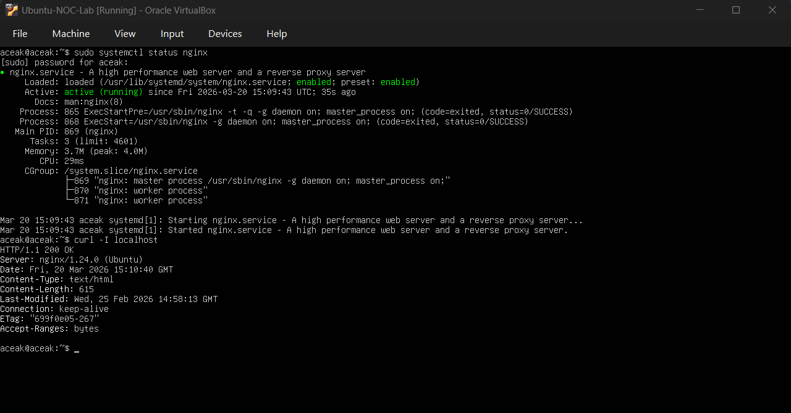
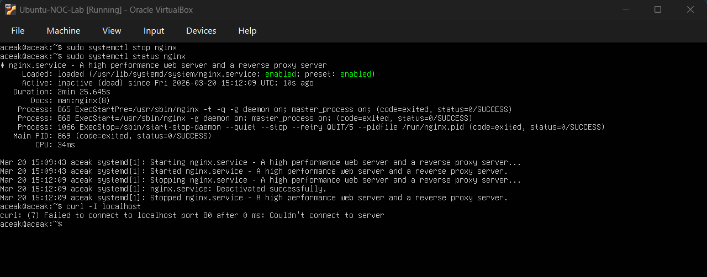
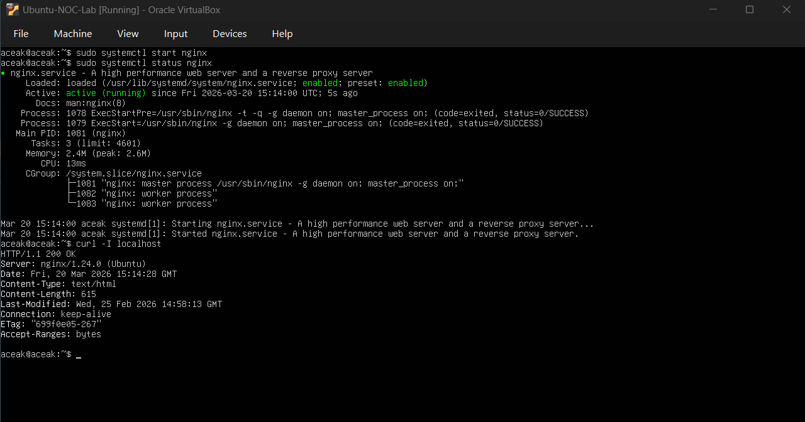
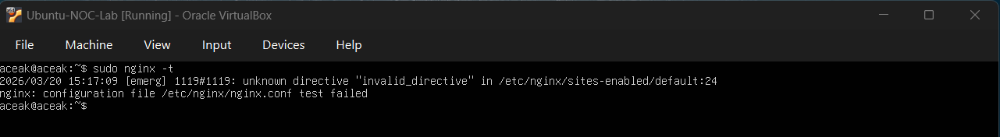
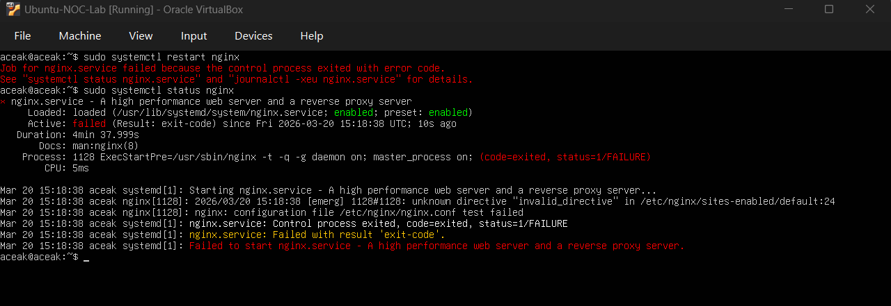
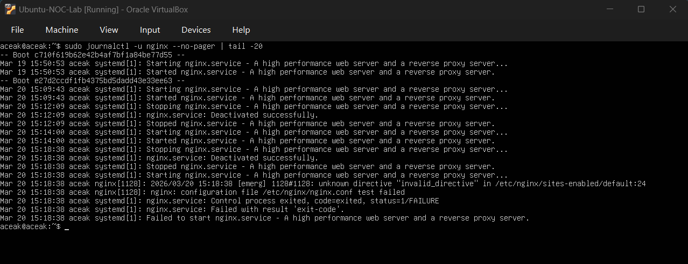
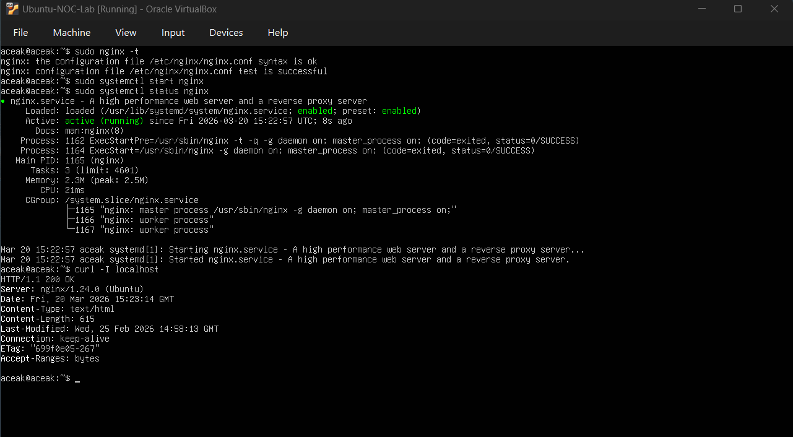

# Nginx Service Failure Simulation

## Objective
To simulate service-level failures and practice troubleshooting techniques to restore application availability. This exercise includes both a service outage and a configuration-based failure scenario.

---

## Scenario 1 — Service Stopped

### Baseline Verification

#### Command Executed
sudo systemctl status nginx  
curl -I localhost  

#### Output Observed
- Service status: **active (running)**  
- HTTP response: **200 OK**  
- Server: **nginx/1.24.0**

#### Baseline Snapshot

#### Interpretation
The nginx service was running normally and serving HTTP requests successfully.

---

### Simulated Service Failure

#### Command Executed
sudo systemctl stop nginx  
sudo systemctl status nginx  

#### Output Observed
- Service status changed to: **inactive (dead)**  

#### Service Stopped

#### Interpretation
The nginx service was intentionally stopped, simulating an unexpected service outage.

---

### Connectivity Test

#### Command Executed
curl localhost  

#### Output Observed
- Connection failed:
  - Failed to connect to localhost port 80

#### Interpretation
The application became unreachable because the web service was not running.

---

### Service Restoration

#### Command Executed
sudo systemctl start nginx  
sudo systemctl status nginx  
curl -I localhost  

#### Output Observed
- Service status: **active (running)**  
- HTTP response: **200 OK**

#### Service Restored

#### Interpretation
The nginx service was successfully restarted, restoring application availability.

---

## Scenario 2 — Configuration Failure

### Introduced Configuration Error

#### Action Performed
Edited the configuration file:

/etc/nginx/sites-enabled/default  

Added invalid directive:
invalid_directive on;

---

### Configuration Validation

#### Command Executed
sudo nginx -t  

#### Output Observed
- unknown directive "invalid_directive"  
- configuration file test failed  

#### Configuration Error Detected

#### Interpretation
The nginx configuration contained an invalid directive, causing validation failure.

---

### Service Startup Failure

#### Command Executed
sudo systemctl restart nginx  
sudo systemctl status nginx  

#### Output Observed
- Service status: **failed (Result: exit-code)**  
- Job for nginx.service failed  

#### Service Failure

#### Interpretation
The service could not start due to invalid configuration, resulting in an application outage.

---

### Root Cause Investigation

#### Command Executed
sudo journalctl -u nginx --no-pager | tail -20  

#### Output Observed
- Logs showed invalid directive error  
- Configuration test failure  
- Service exit with failure status  

#### Log Investigation

#### Interpretation
Log analysis confirmed that the configuration error was the root cause of the service failure.

---

### Configuration Fix

#### Action Performed
Removed the invalid directive from the configuration file.

#### Validation Command
sudo nginx -t  

#### Output Observed
- syntax is ok  
- test is successful  

#### Interpretation
The configuration issue was resolved successfully.

---

### Service Restoration

#### Command Executed
sudo systemctl start nginx  
sudo systemctl status nginx  
curl -I localhost  

#### Output Observed
- Service status: **active (running)**  
- HTTP response: **200 OK**

#### Final Validation

#### Interpretation
The nginx service was fully restored and resumed normal operation.

---

## Skills Practiced

- Service monitoring using `systemctl`  
- Troubleshooting service outages  
- Configuration validation using `nginx -t`  
- Log analysis using `journalctl`  
- Root cause identification  
- Service recovery procedures  
- Application availability validation using `curl`  
- NOC-style incident handling workflow  

---

## Conclusion

This exercise simulated two real-world scenarios: a service outage and a configuration failure. Through structured troubleshooting, the root causes were identified and resolved, restoring full application availability.
