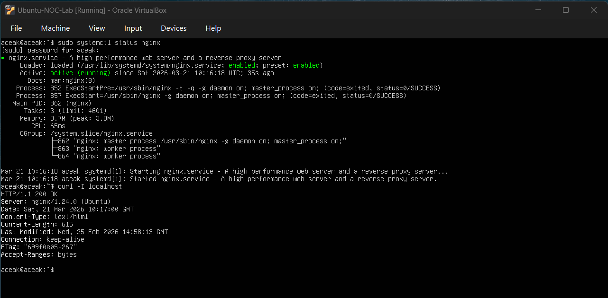
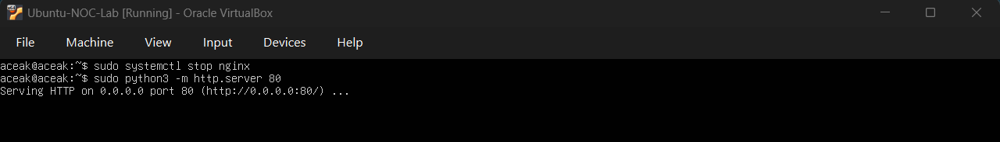
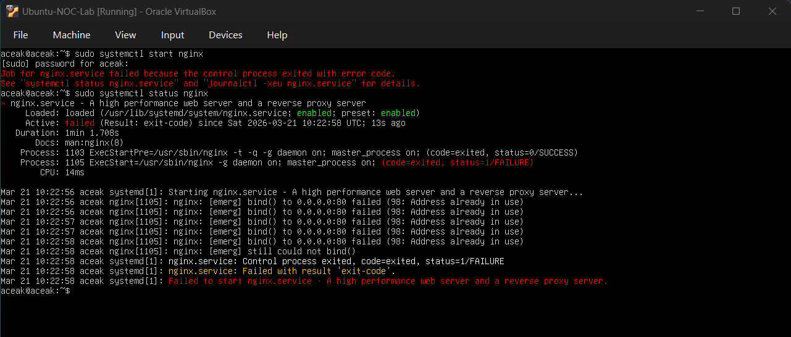
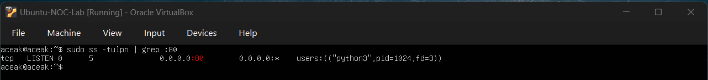
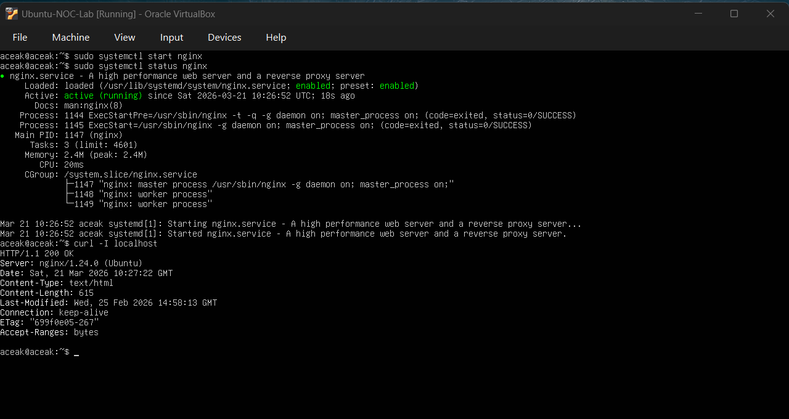

# Port Conflict & Service Binding Failure

## Objective
To simulate a scenario where a service fails to start because another process is already using the required port.

---

## Baseline Verification

### Command Executed
sudo systemctl status nginx  
curl -I localhost  

### Output Observed
- Service status: **active (running)**  
- HTTP response: **200 OK**  
- Server: **nginx/1.24.0**

### Baseline Snapshot

### Interpretation
The nginx service was running normally and serving HTTP requests successfully.

---

## Simulated Port Conflict

### Command Executed
sudo systemctl stop nginx  
sudo python3 -m http.server 80  

### Output Observed
- Python server started:
  - Serving HTTP on 0.0.0.0 port 80  

### Port Occupied

### Interpretation
Port 80 was occupied by the Python HTTP server, preventing other services from binding to the same port.

---

## Service Startup Failure

### Command Executed
sudo systemctl start nginx  
sudo systemctl status nginx  

### Output Observed
- Service status: **failed**  
- Error:
  - bind() to 0.0.0.0:80 failed (98: Address already in use)

### Service Failure

### Interpretation
Nginx failed to start because port 80 was already in use by another process.

---

## Root Cause Investigation

### Command Executed
sudo ss -tulpn | grep :80  

### Output Observed
- Port 80 in LISTEN state  
- Process identified: **python3**  

### Port Check

### Interpretation
The Python HTTP server was confirmed as the process occupying port 80, causing the conflict.

---

## Resolution

### Action Performed
Stopped the Python HTTP server.

### Command Executed
sudo systemctl start nginx  

### Interpretation
The conflicting process was terminated, allowing nginx to bind to port 80 successfully.

---

## Validation

### Command Executed
sudo systemctl status nginx  
curl -I localhost  

### Output Observed
- Service status: **active (running)**  
- HTTP response: **200 OK**  

### Final Validation

### Interpretation
Nginx service was successfully restored and resumed normal operation.

---

## Skills Practiced

- Investigating port conflicts  
- Identifying processes using network ports  
- Troubleshooting service startup failures  
- Using `ss` to inspect listening ports  
- Resolving service binding issues  
- Validating application availability  

---

## Conclusion

This exercise simulated a real-world incident where a service failed to start due to a port conflict. By identifying the process occupying the port and stopping it, the nginx service was successfully restored.
