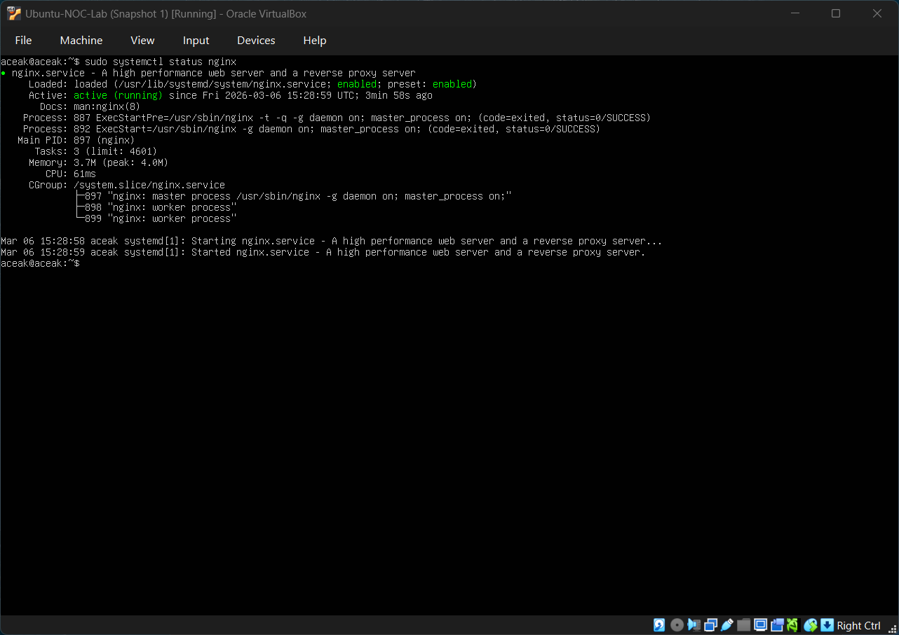
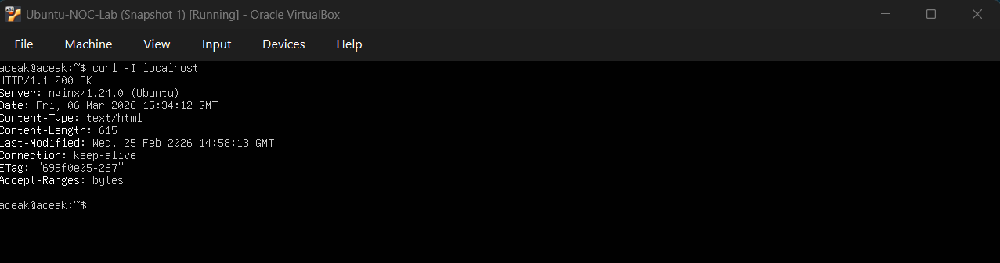
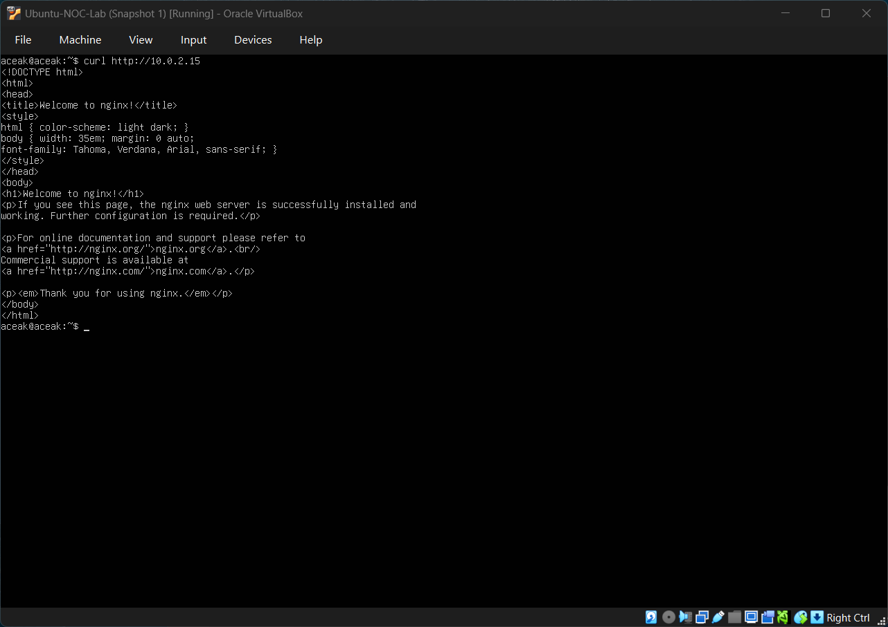
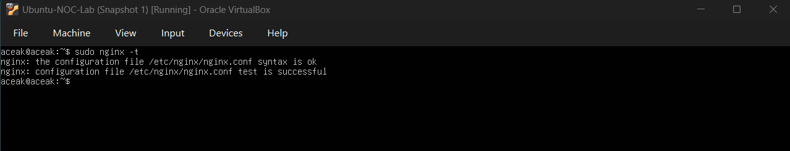
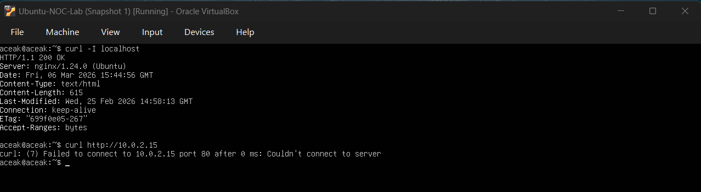
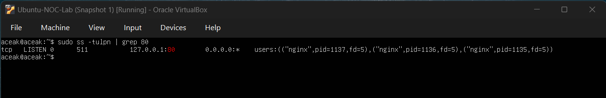
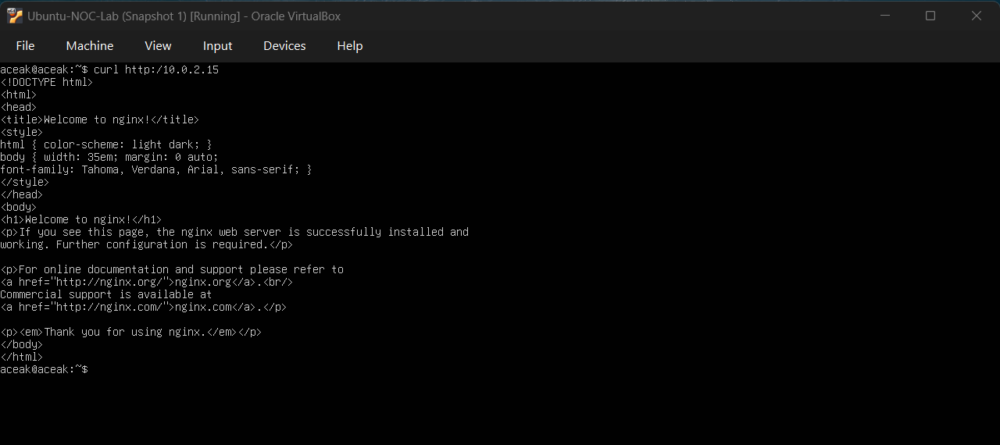

# Nginx Service Binding Misconfiguration

## Objective

Simulate a scenario where nginx is running but only bound to localhost (127.0.0.1), preventing access via the server’s IP address.

---

## Baseline Verification

### Service Status

Command executed:

sudo systemctl status nginx

### Localhost Access Test

Command executed:

curl -I localhost

### IP Access Test (Baseline)

Command executed:

curl http://10.0.2.15

Result: Service accessible via both localhost and IP address.

---

## Incident Simulation

The nginx configuration was modified to bind only to localhost.

Configuration change:

listen 127.0.0.1:80;

Configuration validation:

sudo nginx -t

Service restarted:

sudo systemctl restart nginx

---

## Observed Failure

### Local vs IP Access Comparison

Commands executed:

curl -I localhost  
curl http://10.0.2.15

Observation:

- Localhost access successful
- IP-based access failed

---

## Investigation

Command executed:

sudo ss -tulpn | grep :80

Finding:

nginx was listening on:

127.0.0.1:80

Instead of:

0.0.0.0:80

Root Cause:

The service was bound only to the loopback interface.

---

## Resolution

The configuration was restored to:

listen 80 default_server;  
listen [::]:80 default_server;

Configuration revalidated:

sudo nginx -t  
sudo systemctl restart nginx

---

## Validation

Command executed:

curl http://10.0.2.15

Result:

Service successfully accessible via IP address.

---

## Skills Practiced

- Service binding configuration
- Understanding difference between 127.0.0.1 and 0.0.0.0
- Layered troubleshooting
- Using `ss` to inspect listening interfaces
- Root cause isolation
- Service restoration validation

---

## Conclusion

This exercise demonstrated how a service can appear operational while being inaccessible due to interface binding misconfiguration. Structured investigation identified the root cause and restored full service availability.
