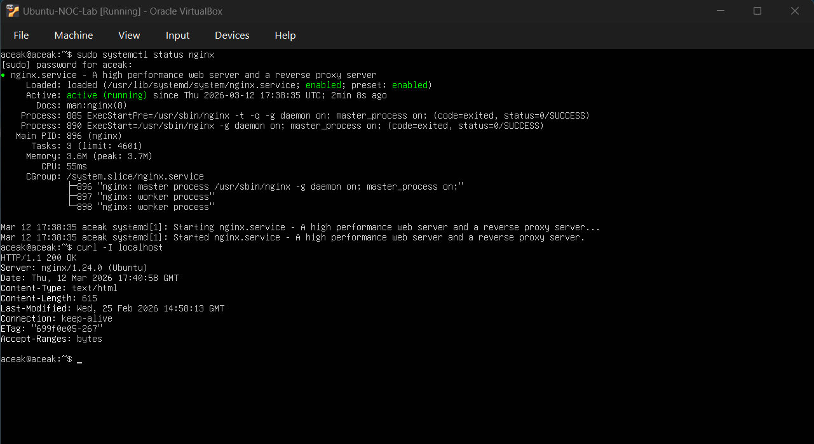
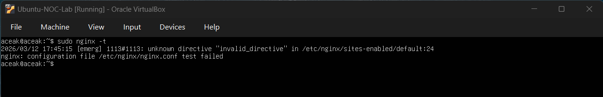
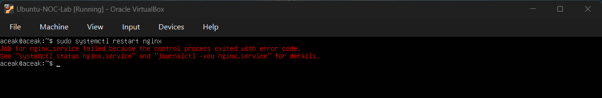
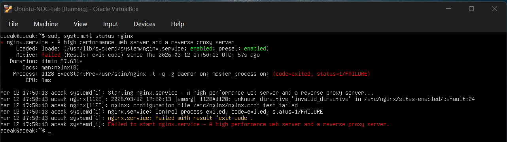
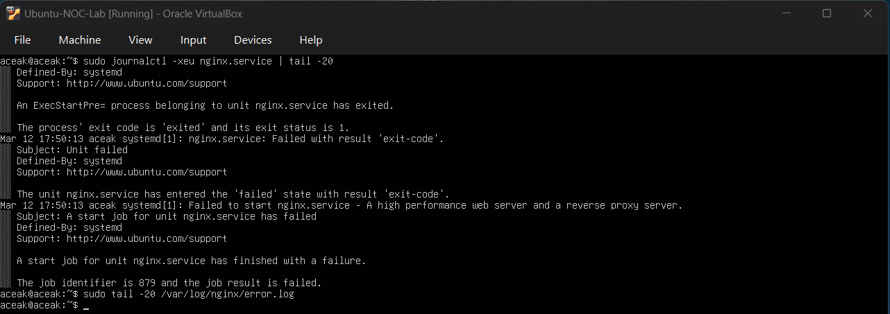
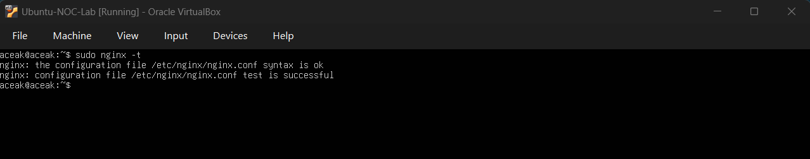

# Nginx Configuration Syntax Failure

## Objective

Simulate a configuration syntax error in nginx, investigate the failure using validation and system logs, and restore the service through structured troubleshooting.

---

## Baseline Service Check

### Command Executed
sudo systemctl status nginx  
curl -I localhost

### Output Observed
- Active: active (running)
- HTTP/1.1 200 OK
- Server: nginx/1.24.0 (Ubuntu)

### Baseline Snapshot

### Interpretation
The nginx service was operating normally before introducing the configuration fault.

---

## Configuration Validation Failure

An invalid directive was added inside:

/etc/nginx/sites-enabled/default

### Command Executed
sudo nginx -t

### Output Observed
- unknown directive "invalid_directive"
- nginx: configuration file test failed
- Reference: /etc/nginx/sites-enabled/default:24

### Configuration Error Detected

### Interpretation
The configuration syntax test failed due to an invalid directive, confirming a misconfiguration.

---

## Service Startup Failure

### Command Executed
sudo systemctl restart nginx  
sudo systemctl status nginx

### Output Observed
- Job for nginx.service failed
- Active: failed (Result: exit-code)

### Service Failure Observed

### Interpretation
Nginx failed to start because configuration validation failed during the pre-start phase.

---

## Log Investigation

### Command Executed
sudo journalctl -xeu nginx.service | tail -20  
sudo tail -20 /var/log/nginx/error.log

### Output Observed
- ExecStartPre process exited with status 1
- Failed to start nginx.service
- No significant entries in error.log

### Log Investigation Snapshot

### Interpretation
The failure occurred during configuration validation (ExecStartPre), preventing nginx from fully starting.

---

## Configuration Correction

The invalid directive was removed from:

/etc/nginx/sites-enabled/default

### Command Executed
sudo nginx -t

### Output Observed
- syntax is ok
- test is successful

### Configuration Fixed

### Interpretation
Configuration validation succeeded after removing the invalid directive.

---

## Service Restoration

### Command Executed
sudo systemctl start nginx  
sudo systemctl status nginx  
curl -I localhost

### Output Observed
- Active: active (running)
- HTTP/1.1 200 OK
- Server: nginx/1.24.0 (Ubuntu)

### Service Restored

### Interpretation
The nginx service was successfully restored and validated.

---

## Skills Practiced

- Configuration syntax validation using `nginx -t`
- Investigating service startup failures
- Log analysis using `journalctl`
- Root cause isolation
- Structured recovery workflow
- Post-incident validation

---

## Conclusion

This exercise simulated a configuration-based nginx service failure. Through systematic validation, log analysis, and configuration correction, the service was successfully restored.
