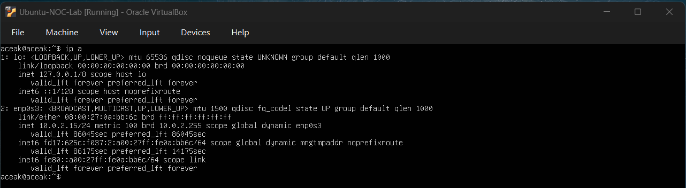
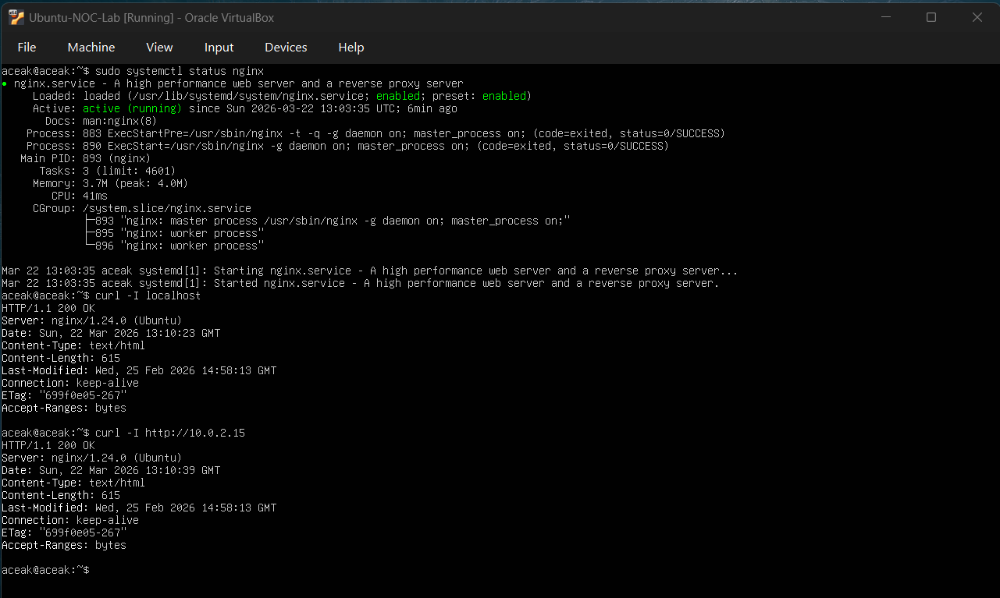
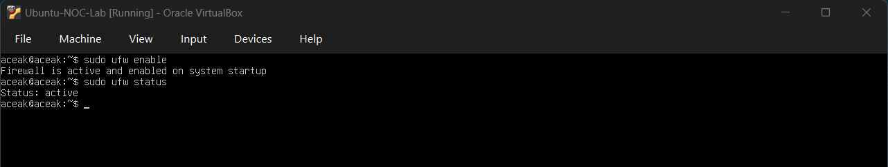
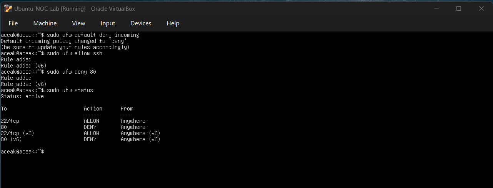
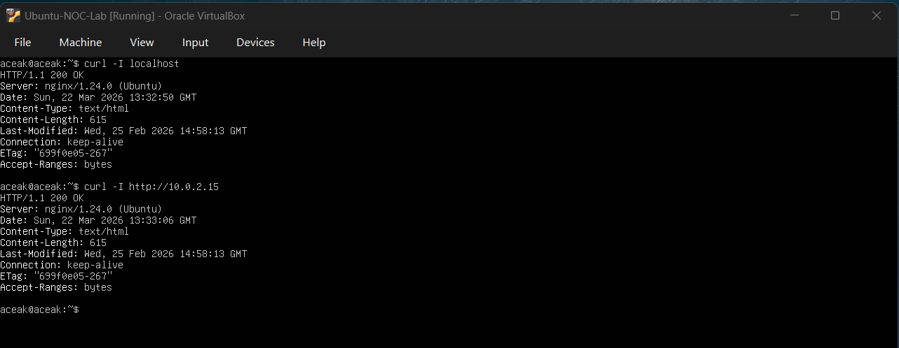
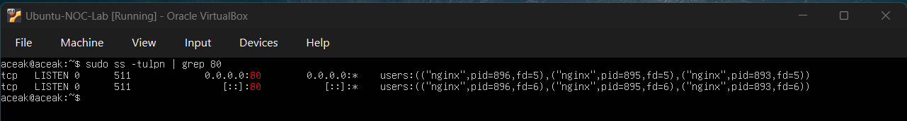

# Firewall-Based Access Control Failure (UFW)

## Objective

Simulate a scenario where firewall rules block HTTP access, investigate accessibility behavior, and validate service exposure under controlled network conditions.

---

## Baseline Verification

### Network Baseline

#### Command Executed
ip a

### Output Observed
- Interface: enp0s3
- IP Address: 10.0.2.15

### Network Baseline Snapshot

### Interpretation
The system has an active network interface with a valid IP address assigned.

---

### Service Baseline

#### Command Executed
sudo systemctl status nginx  
curl -I localhost  
curl -I http://10.0.2.15  

### Output Observed
- Active: active (running)
- HTTP/1.1 200 OK (localhost)
- HTTP/1.1 200 OK (IP)

### Service Baseline Snapshot

### Interpretation
The nginx service is running and accessible via both localhost and system IP.

---

## Firewall Initialization

### Command Executed
sudo ufw enable  
sudo ufw status  

### Output Observed
- Firewall is active

### Firewall Enabled Snapshot

### Interpretation
UFW firewall is enabled with default configuration.

---

## Firewall Rule Configuration

### Command Executed
sudo ufw default deny incoming  
sudo ufw allow ssh  
sudo ufw deny 80  
sudo ufw status  

### Output Observed
- 22/tcp → ALLOW  
- 80 → DENY  

### Firewall Rules Applied

### Interpretation
Incoming HTTP traffic (port 80) is explicitly blocked while SSH access remains allowed.

---

## Access Validation

### Command Executed
curl -I localhost  
curl -I http://10.0.2.15  

### Output Observed
- HTTP/1.1 200 OK (localhost)
- HTTP/1.1 200 OK (IP)

### Firewall Test Snapshot

### Observation
- Localhost access successful  
- IP-based access also successful (unexpected behavior)

---

## Investigation

### Command Executed
sudo ss -tulpn | grep :80  

### Output Observed
- nginx listening on:
  - 0.0.0.0:80  
  - [::]:80  

### Port Verification Snapshot

### Findings
- nginx is correctly bound to all interfaces
- Service is actively listening on port 80

---

## Root Cause Analysis

### Key Finding

Despite firewall rules denying port 80, HTTP access was still successful.

### Root Cause

- The test traffic originated from the same host (local machine)
- UFW primarily filters **external incoming traffic**
- Local loopback/internal traffic bypasses firewall restrictions

### Environmental Limitation

- The VM is configured with **NAT networking**
- NAT prevents true external access simulation from host to guest
- As a result, firewall rules could not be validated through internal curl requests

---

## Resolution

No configuration issue was present in nginx or firewall rules.

### Correct Understanding

- Firewall rules were correctly applied  
- Behavior observed is expected in NAT-based local testing  

### Recommended Approach (Real-World)

- Use **Bridged Adapter** for external testing  
OR  
- Test from a separate machine to validate firewall enforcement  

---

## Validation

### Command Executed
sudo ufw status  
sudo ss -tulpn | grep :80  

### Output Observed
- Port 80 → DENY (UFW)
- nginx → LISTEN on port 80

### Interpretation
Firewall rules are active and service is running, confirming configuration correctness despite local testing limitations.

---

## Skills Practiced

- Firewall configuration using `ufw`
- Access control implementation
- Network-level troubleshooting
- Understanding local vs external traffic behavior
- Service exposure validation
- Identifying environment limitations (NAT vs Bridged)
- Root cause analysis in misleading scenarios

---

## Conclusion

This exercise demonstrated firewall-based access control using UFW. Although HTTP access remained available during testing, investigation revealed that local traffic bypassed firewall enforcement due to NAT-based virtualization. The scenario highlights the importance of understanding network context when validating security controls.
