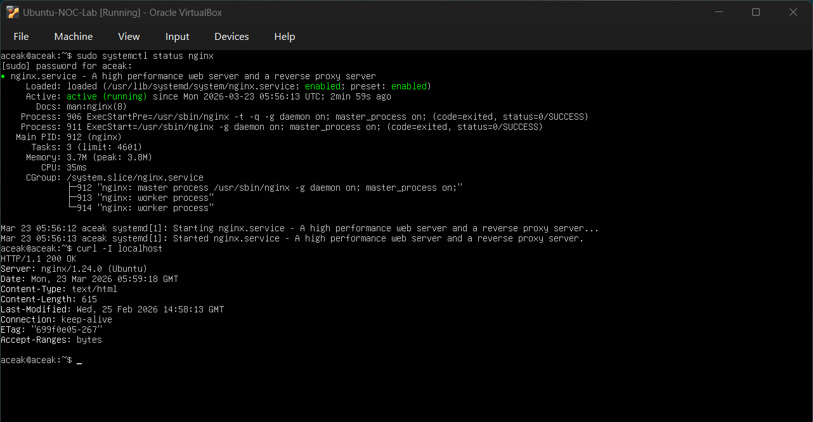
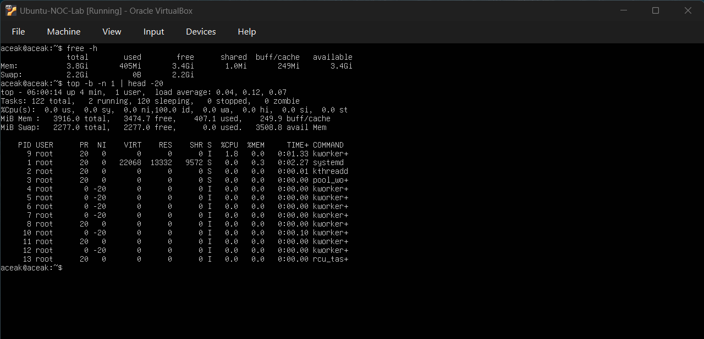
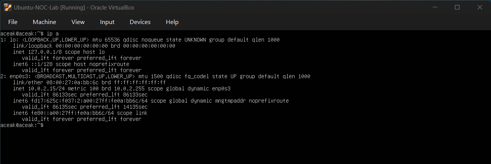
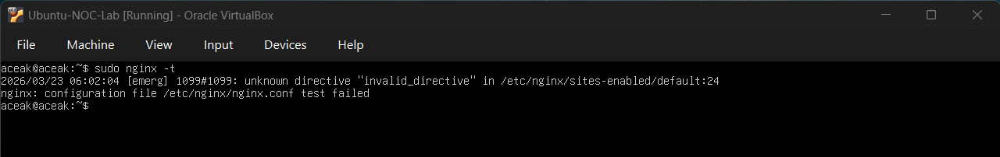
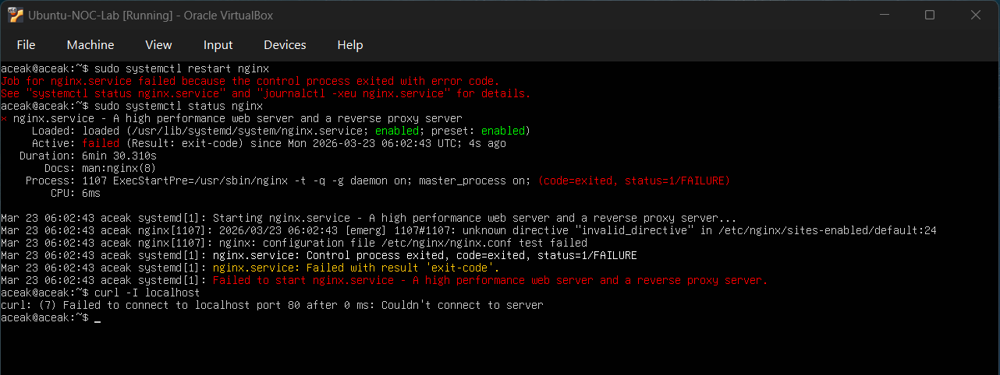
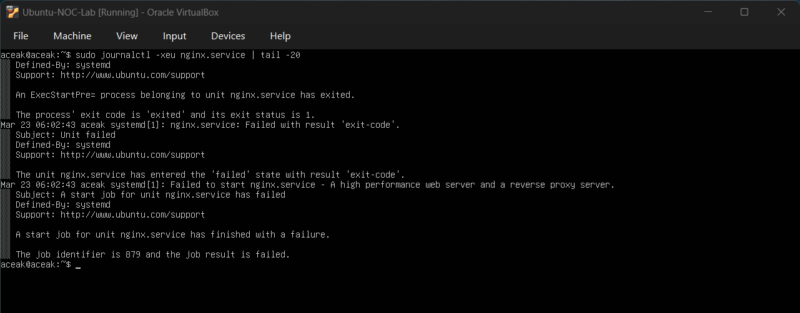
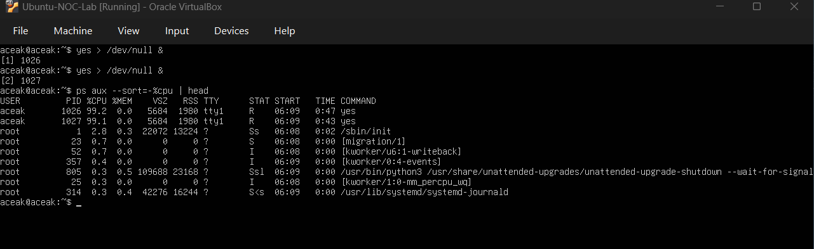
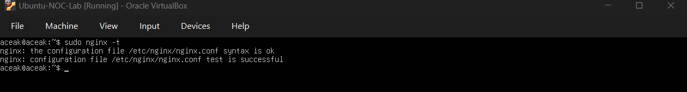
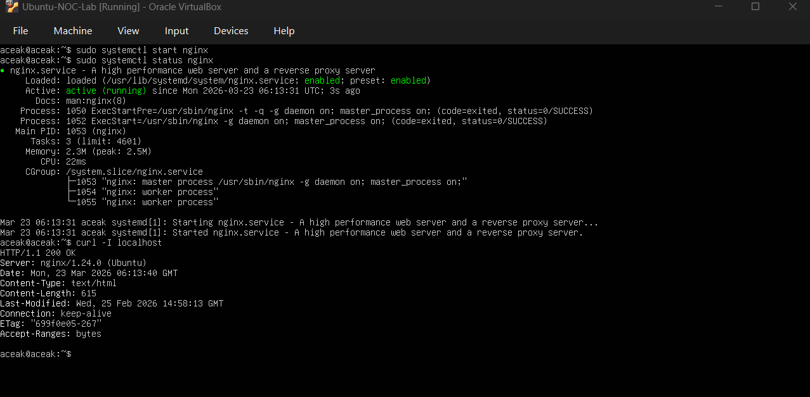

# Capstone: Integrated Incident Response & Monitoring

## Objective

Simulate a multi-layered incident involving service failure, configuration error, and system resource noise. Perform structured troubleshooting to isolate the root cause and restore service availability.

---

## Baseline Verification

### Service Baseline

#### Command Executed
sudo systemctl status nginx  
curl -I localhost

#### Output Observed
- Active: active (running)
- HTTP/1.1 200 OK
- Server: nginx/1.24.0 (Ubuntu)

#### Baseline Snapshot

#### Interpretation
The nginx service was running normally and serving requests successfully.

---

### System Baseline

#### Command Executed
free -h  
top -b -n 1 | head -20

#### Output Observed
- Normal memory usage
- Low CPU utilization

#### Baseline Snapshot

#### Interpretation
System resources were stable prior to incident simulation.

---

### Network Baseline

#### Command Executed
ip a

#### Output Observed
- Active network interface
- IP address assigned (10.0.2.15)

#### Baseline Snapshot

#### Interpretation
The system had proper network configuration and connectivity.

---

## Configuration Validation Failure

### Command Executed
sudo nginx -t

### Output Observed
- unknown directive "invalid_directive"
- nginx: configuration file test failed

### Configuration Error Detected

### Interpretation
The configuration validation failed due to an invalid directive present in the nginx configuration.

---

## Service Startup Failure

### Command Executed
sudo systemctl restart nginx  
sudo systemctl status nginx  
curl -I localhost

### Output Observed
- Job for nginx.service failed
- Active: failed (Result: exit-code)
- curl failed to connect

### Service Failure Observed

### Interpretation
Nginx failed to start due to configuration validation failure, making the service unavailable.

---

## Log Investigation

### Command Executed
sudo journalctl -xeu nginx.service | tail -20

### Output Observed
- ExecStartPre process exited with status 1
- nginx.service entered failed state
- Job result: failed

### Log Investigation Snapshot

### Interpretation
The logs confirm that nginx failed during the pre-start validation phase (ExecStartPre), indicating a configuration-related failure.

---

## System Load Observation (Noise Simulation)

### Command Executed
yes > /dev/null &  
yes > /dev/null &  
ps aux --sort=-%cpu | head

### Output Observed
- High CPU usage observed
- Multiple `yes` processes consuming CPU

### CPU Load Snapshot

### Interpretation
CPU load was intentionally introduced to simulate environmental noise. Despite increased CPU usage, the root cause remained isolated to nginx configuration failure.

---

## Root Cause Differentiation

### Reasoning
High CPU utilization was observed from `yes` processes. However, `systemctl status nginx` confirmed the failure predated the CPU load and showed an `ExecStartPre` exit code — indicating startup failure during configuration validation, not resource exhaustion.

The `journalctl` logs further confirmed the failure occurred at the pre-start phase, with no memory or CPU-related errors present. The CPU load was identified as environmental noise and eliminated as a contributing factor. Investigation was refocused on the configuration error as the sole root cause.

### Conclusion
- CPU spike → Environmental noise (unrelated to service failure)
- nginx ExecStartPre failure → Root cause (invalid configuration directive)

---

## Configuration Correction

### Command Executed
sudo nginx -t

### Output Observed
- syntax is ok
- test is successful

### Configuration Fixed

### Interpretation
The configuration issue was resolved successfully after removing the invalid directive.

---

## Service Restoration

### Command Executed
sudo systemctl start nginx  
sudo systemctl status nginx  
curl -I localhost

### Output Observed
- Active: active (running)
- HTTP/1.1 200 OK

### Service Restored

### Interpretation
The nginx service was successfully restored and validated after resolving the configuration issue.

---

## Skills Practiced

- Multi-layer incident troubleshooting
- Configuration validation using `nginx -t`
- Log analysis using `journalctl`
- Service failure investigation
- CPU load simulation and noise handling
- Root cause isolation under pressure
- Structured incident response workflow

---

## Conclusion

This capstone lab simulated a real-world incident involving service failure and system noise. Through systematic investigation, the root cause was identified as a configuration error, not resource exhaustion. The CPU spike was actively triaged and eliminated as a red herring before focusing on the configuration fix. The issue was resolved and service availability was restored, demonstrating end-to-end NOC troubleshooting capability.
